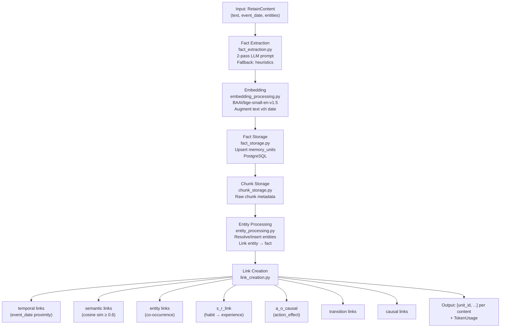
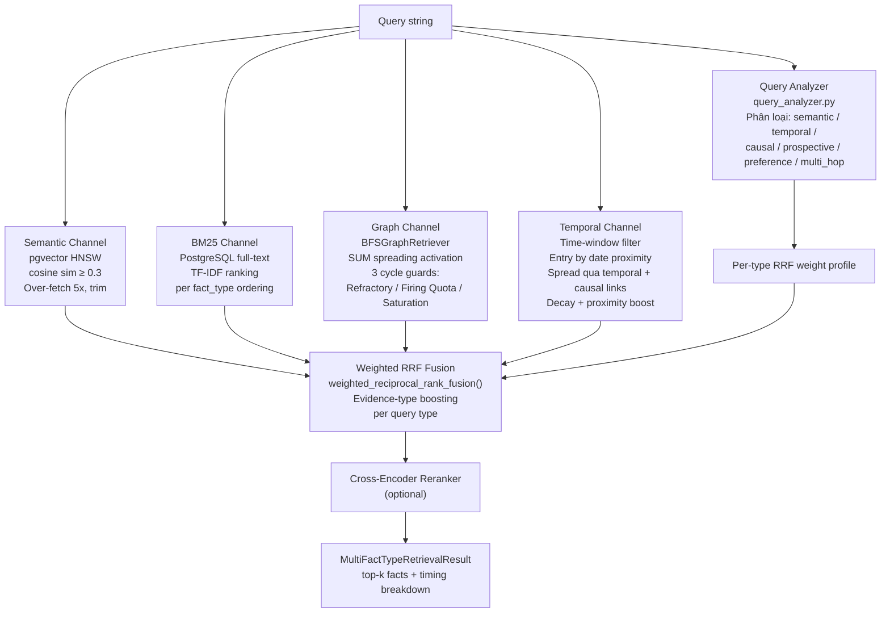
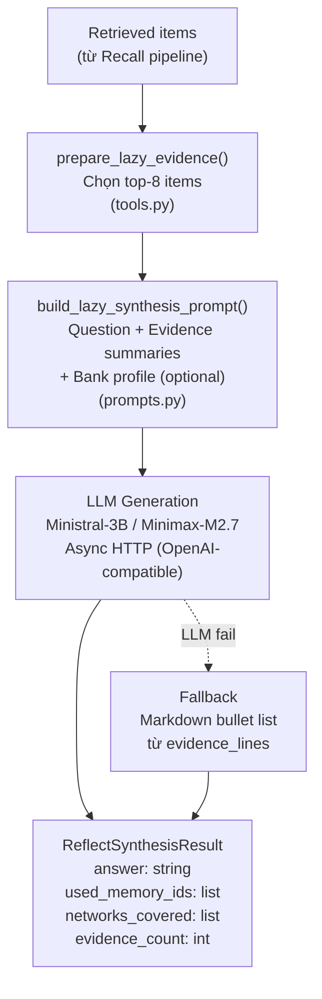
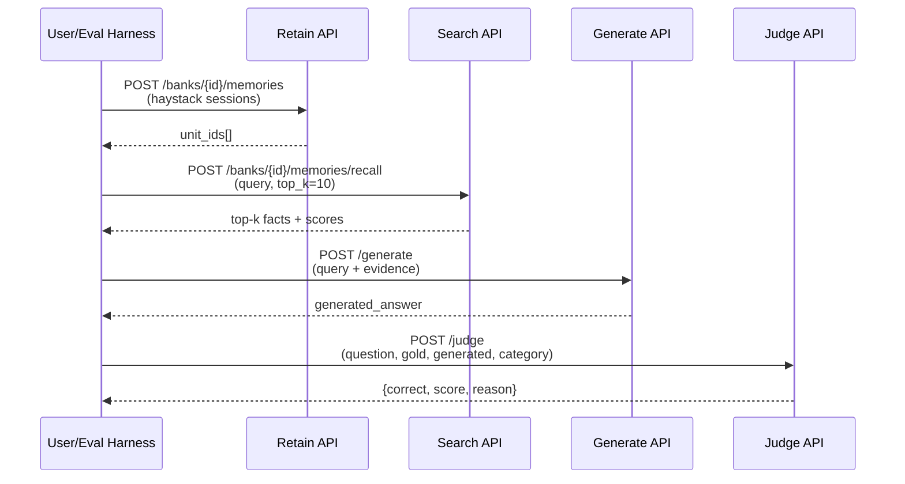
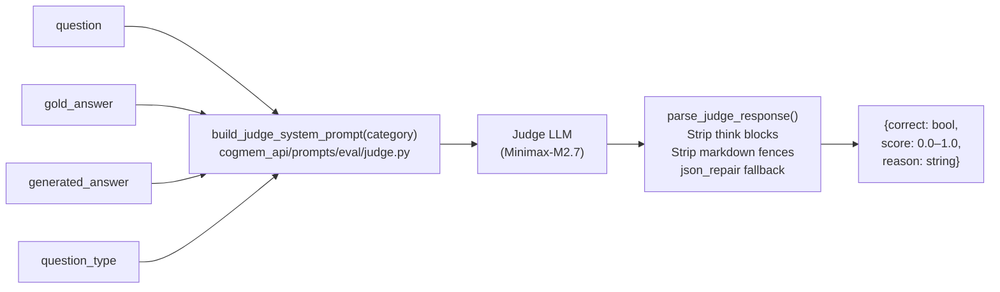

# CogMem — Pipeline, Dataset & Evaluation Overview

> Generated: 2026-05-05 | Experiment: E7 Full CogMem | Benchmark: LongMemEval-S (distilled, 12 conv)

---

## 1. Ba Pipeline chính

CogMem vận hành qua ba pipeline tuần tự: **Retain → Recall → Generation**, cùng một **Judge pipeline** độc lập dùng cho evaluation.

---

### 1.1 Retain Pipeline

Ingests hội thoại thô → trích xuất facts có kiểu dữ liệu → embedding → lưu vào PostgreSQL → tạo graph links.

**Entry point:** `cogmem_api/engine/retain/orchestrator.py` → `retain_batch()`



**6 loại fact (networks):**

| Type | Ý nghĩa | Metadata đặc biệt |
|------|---------|-------------------|
| `world` | Sự kiện khách quan, không phụ thuộc thời gian | — |
| `experience` | Sự kiện cá nhân tại một thời điểm cụ thể | `occurred_start`, `occurred_end` |
| `opinion` | Niềm tin hoặc sở thích | `confidence` |
| `habit` | Hành vi lặp lại | s_r_link đến experience liên quan |
| `intention` | Mục tiêu hoặc kế hoạch tương lai | `intention_status`: planning \| fulfilled \| abandoned |
| `action_effect` | Bộ ba nhân-quả | `precondition`, `action`, `outcome`, `confidence` |

---

### 1.2 Recall Pipeline (Search)

4-kênh retrieval song song → weighted RRF fusion → top-k kết quả.

**Entry point:** `cogmem_api/engine/search/retrieval.py` → `retrieve_all_fact_types_parallel()`



**Adaptive Query Routing — weight profiles:**

| Query Type | Semantic | BM25 | Graph | Temporal | Trigger |
|-----------|----------|------|-------|----------|---------|
| `semantic` | High | Mid | Low | — | Default |
| `temporal` | Mid | Low | Low | **High** | Date expressions |
| `causal` | Low | Mid | **High** | — | Causal keywords |
| `prospective` | Mid | Low | Mid | Mid | "plan/intend/going to" |
| `preference` | **High** | Mid | Low | — | Preference queries |
| `multi_hop` | Mid | Mid | **High** | — | Multi-entity queries |

---

### 1.3 Generation Pipeline (Reflect)

Synthesize câu trả lời từ evidence đã retrieve, dùng LLM.

**Entry point:** `cogmem_api/engine/reflect/agent.py` → `synthesize_lazy_reflect()`



**Generation prompt có hướng dẫn:**
- Deduplication cho câu "how many" (liệt kê → deduplicate → đếm)
- Temporal ordering: dùng session timestamp khi có conflict
- Knowledge-update: ưu tiên thông tin mới nhất
- Depersonalization: convert "I/my" → "you/your"

---

### 1.4 Luồng End-to-End (E2E)



---

## 2. Dataset: 12 Conversations trong `longmemeval_s_distilled_small.json`

### 2.1 Quy trình chọn lọc (từ `scripts/distill_dataset.py`)

Dataset gốc LongMemEval-S được distill qua hai bước:

**Bước 1 — Lọc `longmemeval_s_cleaned.json` → `longmemeval_s_distilled.json`** bằng `is_extremely_hard_lme()`:

```
Quota (scale = 1/3 so với gốc):
  knowledge-update:  12 samples
  temporal-reasoning: 12 samples
  multi-session:     12 samples
  abstention:         7 samples
  prospective:        5 samples
  single-session:     5 samples
```

Ưu tiên theo thứ tự:
1. `_abs` suffix → abstention
2. Prospective keywords ("plan", "going to", "intend", ...) → prospective
3. `knowledge-update` type → giữ toàn bộ quota
4. `temporal-reasoning` type → giữ toàn bộ quota
5. `multi-session` với ≥ 3 evidence sessions → giữ
6. `single-session-preference` / `single-session-user` → lấy rất ít

**Bước 2 — Chọn 12 hội thoại tốt nhất** bằng `build_lme_small_subset(target_total=12)`:

Mỗi item được tính điểm bởi `small_subset_score()`:

```
score = priority × 100
      + min(session_gap, 25) × 3
      + min(conflict_density, 20) × 2
      + min(entity_overlap, 25)

priority: multi-session=3, knowledge-update=2, temporal-reasoning=1
session_gap: khoảng cách index giữa answer sessions trong haystack
conflict_density: số keyword "change/update/moved/switch/..." xuất hiện
entity_overlap: số entity xuất hiện ở ≥ 2 sessions
```

Quota ưu tiên: `multi-session=5`, `knowledge-update=4`, `temporal-reasoning=3`.

Trong mỗi type, chọn item có **score cao nhất** trước. Nếu chưa đủ 12, bổ sung theo tổng điểm.

---

### 2.2 Chi tiết 12 Conversations

| # | question_id | Type | Sessions | Ans Sessions | Session Gap | Question | Gold Answer |
|---|-------------|------|:--------:|:------------:|:-----------:|----------|-------------|
| 0 | `gpt4_59c863d7` | multi-session | 47 | 4 | 42 | How many model kits have I worked on or bought? | 5 kits: F-15 Eagle, Spitfire Mk.V, Tiger I, B-29, '69 Camaro |
| 1 | `6456829e_abs` | multi-session | 53 | 2 | 31 | How many plants did I initially plant for tomatoes and chili peppers? | 5 tomato plants; no info on chili peppers |
| 2 | `2311e44b_abs` | multi-session | 49 | 2 | 35 | How many pages do I have left to read in 'Sapiens'? | Not mentioned in memory |
| 3 | `gpt4_15e38248` | multi-session | 46 | 4 | 36 | How many pieces of furniture did I buy, assemble, sell, or fix? | 4 |
| 4 | `1a8a66a6` | multi-session | 51 | 4 | 38 | How many magazine subscriptions do I currently have? | 2 |
| 5 | `e66b632c` | knowledge-update | 47 | 2 | 41 | What was my previous personal best time for the charity 5K run? | 27 minutes and 45 seconds |
| 6 | `07741c45` | knowledge-update | 49 | 2 | 29 | Where do I currently keep my old sneakers? | In a shoe rack in my closet |
| 7 | `852ce960` | knowledge-update | 39 | 2 | 34 | What was the amount I was pre-approved for when I got my mortgage from Wells Fargo? | $400,000 |
| 8 | `18bc8abd` | knowledge-update | 44 | 2 | 26 | What brand of BBQ sauce am I currently obsessed with? | Kansas City Masterpiece |
| 9 | `gpt4_70e84552` | temporal-reasoning | 48 | 2 | 30 | Which task did I complete first, fixing the fence or trimming the goats' hooves? | Fixing the fence |
| 10 | `b46e15ee` | temporal-reasoning | 42 | 4 | 27 | What charity event did I participate in a month ago? | The 'Walk for Hunger' charity event |
| 11 | `gpt4_8279ba02` | temporal-reasoning | 47 | 1 | 35 | How many days ago did I buy a smoker? | 10 days ago (11 cũng chấp nhận) |

**Phân bố type:** multi-session (5) + knowledge-update (4) + temporal-reasoning (3) = **12**

**Tại sao chọn những item này?**
- `multi-session`: evidence nằm rải rác ở nhiều sessions (session_gap=26–42), cần aggregation mạnh
- `knowledge-update`: hai sessions conflict nhau về cùng một entity (e.g., $350k vs $400k, under bed vs shoe rack)
- `temporal-reasoning`: đòi hỏi suy luận thứ tự thời gian hoặc tính ngày tương đối
- `_abs` suffix (c001, c002): test khả năng abstention — không hallucinate khi thiếu thông tin

---

## 3. Eval (Judge Pipeline) và Kết quả

### 3.1 Judge Pipeline

Judge là một LLM-as-Judge call riêng biệt, sau khi generation đã hoàn thành.



**Rubric theo category:**

| Category | Rubric |
|----------|--------|
| `temporal` / `temporal-reasoning` | 1.0=đúng+đủ; 0.7–0.9=đúng nhưng thiếu detail nhỏ; 0.3–0.6=đúng topic nhưng sai số/thiếu facts; 0.0–0.2=sai/bịa. Off-by-one days/weeks không bị trừ điểm |
| `knowledge-update` | correct=true nếu response có câu trả lời **đã cập nhật**; chấp nhận nếu nêu cả thông tin cũ kèm mới |
| `preference` / `single-session-preference` | correct=true nếu model dùng đúng thông tin cá nhân của user; không cần phản ánh đầy đủ mọi điểm |
| `abstention` | correct=true nếu gold="not mentioned" **và** model nói không biết; correct=false nếu model bịa |
| Default (multi-session, ...) | Cùng rubric 0.0–1.0; câu count: sai số → score ≤ 0.3 dù đúng topic |

---

### 3.2 Kết quả Experiments v13 (Profile E7 — Full CogMem)

**Config E7:**
- Enabled networks: `world`, `experience`, `opinion`, `habit`, `intention`, `action_effect` (tất cả 6)
- Adaptive router: **bật**
- SUM activation: **bật**
- Reranker (cross-encoder): **bật**
- top_k recall: 10 (với reranker expand lên 25)

| # | Checkpoint | question_id | Type | Question (tóm tắt) | Gold | Judge Correct | Score | Session R@5 | Session R@10 | Ghi chú |
|---|-----------|-------------|------|--------------------|------|:-------------:|:-----:|:-----------:|:------------:|---------|
| c000 | E7_full_c000 | `gpt4_59c863d7` | multi-session | How many model kits worked on/bought? | 5 kits | ✅ Pass | 1.0 | 0.50 | 0.50 | Đếm đúng 5, liệt kê đủ |
| c001 | E7_full_c001 | `6456829e_abs` | multi-session | How many tomato + chili plants? | 5 tomato, no chili info | ✅ Pass | 1.0 | 0.50 | 0.50 | Abstain đúng về chili |
| c002 | E7_full_c002 | `2311e44b_abs` | multi-session | Pages left in 'Sapiens'? | Not mentioned | ✅ Pass | 1.0 | 1.00 | 1.00 | Abstain đúng |
| c003 | E7_full_c003 | `gpt4_15e38248` | multi-session | How many furniture pieces? | 4 | ❌ Fail | 0.3 | 1.00 | 1.00 | Model trả lời 3, thiếu 1 item (mattress) |
| c004 | E7_full_c004 | `1a8a66a6` | multi-session | How many magazine subscriptions? | 2 | ❌ Fail | 0.0 | 0.50 | 0.50 | Model chỉ tìm được 1 (The New Yorker), bỏ sót Forbes |
| c005 | E7_full_c005 | `e66b632c` | knowledge-update | Previous 5K PB? | 27:45 | ✅ Pass | 1.0 | 1.00 | 1.00 | ISO timestamp trong memory giúp resolve conflict |
| c006 | E7_full_c006 | `07741c45` | knowledge-update | Where are old sneakers? | Shoe rack in closet | ✅ Pass | 1.0 | 1.00 | 1.00 | Chọn đúng thông tin mới nhất |
| c007 | E7_full_c007 | `852ce960` | knowledge-update | Mortgage pre-approval (Wells Fargo)? | $400,000 | ✅ Pass | 1.0 | 1.00 | 1.00 | Conflict $350k vs $400k → chọn đúng |
| c008 | E7_full_c008 | `18bc8abd` | knowledge-update | Current BBQ sauce obsession? | Kansas City Masterpiece | ✅ Pass | 1.0 | 1.00 | 1.00 | Preference đơn giản, retrieve đúng |
| c009 | E7_full_c009 | `gpt4_70e84552` | temporal-reasoning | Fence or goat hooves first? | Fixing the fence | ✅ Pass | 1.0 | 1.00 | 1.00 | Chain-of-thought của Minimax-M2.7 sắp xếp đúng thứ tự |
| c010 | E7_full_c010 | `b46e15ee` | temporal-reasoning | Charity event a month ago? | Walk for Hunger | ✅ Pass | 1.0 | 0.50 | 0.75 | Correct nhưng session recall thấp (chỉ 2/4 gold sessions) |
| c011 | E7_full_c011 | `gpt4_8279ba02` | temporal-reasoning | How many days ago bought smoker? | 10 days ago | ✅ Pass | 1.0 | 1.00 | 1.00 | Tính ngày chính xác từ purchase date trong memory |

**Tổng kết:**

| Metric | Giá trị |
|--------|---------|
| **Judge Accuracy** | **10/12 = 83.3%** |
| Judge Score Mean | 0.942 |
| Session Recall@5 Mean | 0.792 |
| Session Recall@10 Mean | 0.854 |

**Theo category:**

| Category | Count | Correct | Accuracy | Session R@5 |
|----------|:-----:|:-------:|:--------:|:-----------:|
| multi-session | 5 | 3/5 | 60% | 0.70 |
| knowledge-update | 4 | 4/4 | **100%** | 1.00 |
| temporal-reasoning | 3 | 3/3 | **100%** | 0.83 |

---

### 3.3 Phân tích lỗi

#### F1 — Recall Breadth (c003, c004)

**Triệu chứng:** Session Recall@5 = 0.5 → chỉ retrieve được 2/4 gold sessions.

**Nguyên nhân:** RRF + cross-encoder reranker tập trung điểm vào sessions giống query nhất (cosine similarity cao), bỏ qua sessions chứa thông tin bổ sung nhưng semantically xa hơn.

- **c003:** Bỏ sót session chứa "mattress" → model đếm được 3 thay vì 4 furniture pieces.
- **c004:** Bỏ sót session chứa Forbes subscription → model trả lời 1 thay vì 2.

**Hướng fix:** Tăng top_k hoặc áp dụng session-aware re-ranking để đảm bảo diversity.

#### F2 — Count Aggregation (c003)

**Triệu chứng:** Recall đủ sessions (R@5 = 1.0) nhưng vẫn đếm sai.

**Nguyên nhân:** Deduplication logic trong generation prompt có thể đã gộp nhầm hai items khác nhau (e.g., coffee table + dinner table → collapse thành 1).

#### Lưu ý về c003

Gold answer = 4, model trả lời 3, **nhưng judge score = 0.3** (không pass). Judge LLM (cùng Minimax-M2.7 với generator) xác nhận sai rõ ràng → không có bias đồng mô hình trong case này.

---

### 3.4 Điểm mạnh quan sát được

1. **Knowledge-update 100%** — Session timestamp trong memory (khi có ISO date rõ ràng) cho phép model ưu tiên đúng thông tin mới nhất.
2. **Temporal reasoning 100%** — Chain-of-thought của Minimax-M2.7 sắp xếp chronological order từ evidence.
3. **Abstention hoạt động đúng** — Cả 2 `_abs` conv đều pass, model không hallucinate.
4. **6-network extraction** — Fact type phân loại đúng giúp adaptive router chọn channel phù hợp.

---

*File này được generate từ:*
- *`experiments/v13/checkpoints/E7_full_c000.json` – `E7_full_c011.json`*
- *`data/longmemeval_s_distilled_small.json`*
- *`scripts/distill_dataset.py`*
- *`cogmem_api/engine/retain/orchestrator.py`, `search/retrieval.py`, `reflect/agent.py`*
- *`cogmem_api/prompts/eval/judge.py`*
