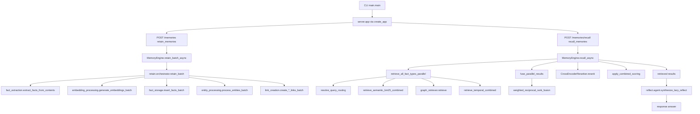

# Retain -> Recall -> Reflect -> Response (Module Flow)

## Purpose
- Tài liệu hóa flow chính của CogMem theo chuỗi retain -> recall -> reflect -> response.
- Chỉ rõ entry points theo module và function để làm nền cho S17.2 (module dossiers).

## Inputs
- Runtime CLI input: host, port, workers, log-level từ `cogmem_api/main.py`.
- HTTP retain input: `RetainRequest` trong `cogmem_api/api/http.py`.
- HTTP recall input: `RecallRequest` trong `cogmem_api/api/http.py`.
- Reflect input (module-level composition): `question` + `retrieved_items` cho `synthesize_lazy_reflect`.

## Outputs
- Retain output: `RetainResponse` gồm danh sách `unit_ids` theo từng item ingest.
- Recall output: `RecallResponse` gồm `results` và `trace` tùy chọn.
- Reflect output: `ReflectSynthesisResult` (answer, evidence IDs, networks covered).
- Response cuối: câu trả lời được tổng hợp từ bằng chứng retrieve (nếu gọi reflect path).

## Top-down level
- Module

## Prerequisites
- Đọc `tutorials/README.md` để nắm contract heading và evidence chuẩn.
- Đọc `tutorials/module-map.md` (Layer 1) để nắm boundary retain/recall/reflect.
- Đọc `tutorials/learning-path.md` theo thứ tự Architecture -> Module -> Function.

## Module responsibility
- Runtime/API boundary:
  - File: `cogmem_api/main.py`
  - Function: `main`
  - Evidence: boot Uvicorn và trỏ vào `cogmem_api.server:app`.
  - File: `cogmem_api/api/http.py`
  - Function: `create_app`
  - Evidence: khai báo route retain/recall, bind `MemoryEngine` vào app state.
- Retain pipeline boundary:
  - File: `cogmem_api/engine/memory_engine.py`
  - Function: `retain_batch_async`
  - Evidence: route từ HTTP xuống orchestrator retain.
  - File: `cogmem_api/engine/retain/orchestrator.py`
  - Function: `retain_batch`
  - Evidence: điều phối extraction -> embeddings -> DB write -> entity/link creation.
- Recall pipeline boundary:
  - File: `cogmem_api/engine/memory_engine.py`
  - Function: `recall_async`
  - Evidence: tạo query embedding, gọi retrieval 4 kênh, fusion + rerank.
  - File: `cogmem_api/engine/search/retrieval.py`
  - Function: `retrieve_all_fact_types_parallel`
  - Evidence: query routing, semantic/BM25/graph/temporal retrieval theo fact type.
  - File: `cogmem_api/engine/search/retrieval.py`
  - Function: `fuse_parallel_results`
  - Evidence: weighted RRF + evidence priority theo query type.
- Reflect boundary:
  - File: `cogmem_api/engine/reflect/agent.py`
  - Function: `synthesize_lazy_reflect`
  - Evidence: tổng hợp answer từ `retrieved_items`, không phụ thuộc observation pipeline.

Flow graph (module-level):

## Function inventory (public/private)
- Public functions (entry points):
  - File: `cogmem_api/main.py`
  - Function: `main`
  - Vai trò: entrypoint CLI để chạy service.
  - File: `cogmem_api/api/http.py`
  - Function: `create_app`
  - Vai trò: factory tạo FastAPI app và route handlers.
  - File: `cogmem_api/api/http.py`
  - Function: `retain_memories`
  - Vai trò: nhận ingest payload và gọi `retain_batch_async`.
  - File: `cogmem_api/api/http.py`
  - Function: `recall_memories`
  - Vai trò: nhận query payload và gọi `recall_async`.
  - File: `cogmem_api/engine/memory_engine.py`
  - Function: `retain_batch_async`
  - Vai trò: cổng retain runtime vào orchestrator.
  - File: `cogmem_api/engine/memory_engine.py`
  - Function: `recall_async`
  - Vai trò: cổng recall runtime với retrieval + fusion + rerank.
  - File: `cogmem_api/engine/retain/orchestrator.py`
  - Function: `retain_batch`
  - Vai trò: điều phối retain pipeline end-to-end.
  - File: `cogmem_api/engine/search/retrieval.py`
  - Function: `retrieve_all_fact_types_parallel`
  - Vai trò: chạy retrieval đa fact-type theo routing decision.
  - File: `cogmem_api/engine/search/retrieval.py`
  - Function: `fuse_parallel_results`
  - Vai trò: hợp nhất danh sách candidate theo adaptive weighted-RRF.
  - File: `cogmem_api/engine/reflect/agent.py`
  - Function: `synthesize_lazy_reflect`
  - Vai trò: tổng hợp response từ evidence sau retrieve.
- Private/internal helpers (phục vụ flow):
  - File: `cogmem_api/api/http.py`
  - Function: `_build_retain_payload`, `_parse_query_timestamp`
  - Vai trò: chuẩn hóa request trước khi gọi MemoryEngine.
  - File: `cogmem_api/engine/search/retrieval.py`
  - Function: `_select_fact_types_for_query`, `_apply_query_type_evidence_priority`, `_resolve_planning_intention_ids`
  - Vai trò: ràng buộc semantics routing (đặc biệt causal/prospective).
  - File: `cogmem_api/engine/reflect/agent.py`
  - Function: `_default_markdown_answer`
  - Vai trò: fallback response khi không có llm_generate hoặc evidence yếu.
  - File: `cogmem_api/engine/reflect/tools.py`
  - Function: `_normalize_payload`, `_coerce_score`, `_coerce_datetime`
  - Vai trò: chuẩn hóa candidate retrieve thành evidence cho reflect.

## Failure modes
- Runtime chưa init:
  - File: `cogmem_api/engine/memory_engine.py`
  - Function: `retain_batch_async`, `recall_async`
  - Dấu hiệu: raise `RuntimeError` khi `_initialized` hoặc `_pool` chưa sẵn sàng.
- Query timestamp sai format:
  - File: `cogmem_api/api/http.py`
  - Function: `_parse_query_timestamp`
  - Dấu hiệu: HTTP 400 với chi tiết `Invalid query_timestamp`.
- Lỗi retrieval pipeline:
  - File: `cogmem_api/engine/memory_engine.py`
  - Function: `recall_async`
  - Dấu hiệu: rơi vào `_fallback_recall_from_conn` và trace ghi `lexical_db_scan`.
- Lỗi embedding provider khi khởi tạo:
  - File: `cogmem_api/engine/memory_engine.py`
  - Function: `_initialize_embeddings_model`
  - Dấu hiệu: warning log và fallback sang `DeterministicEmbeddings`.

## Verify commands
- `uv run python tests/artifacts/test_task716_tutorial_framework.py`
- `uv run python tests/artifacts/test_task717_tutorial_core.py`
- `rg -n "retain_memories|recall_memories|retain_batch_async|recall_async" cogmem_api/api cogmem_api/engine`
- `rg -n "retrieve_all_fact_types_parallel|fuse_parallel_results|synthesize_lazy_reflect" cogmem_api/engine`